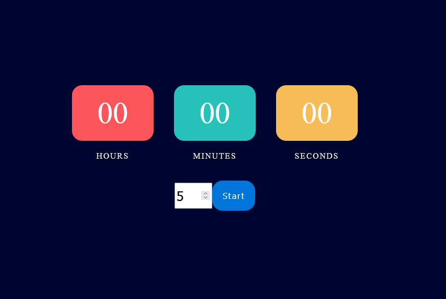

# About Local Javascript Timer



Local Javascript Timer is a simple, browser-based timer app for classroom or office use. Because it uses the javascript SetInterval function, it is not suitable for any use-case that requires precise time-telling. 

Much of the CSS design and some of the html & javascript code was taken from https://github.com/kadjahoe/Javascript-Timer.

## Audio
This project doesn't include audio files for mouse clicks, clock ticking, and buzzing sounds. You can get your own sounds from https://opengameart.org/. These files should be placed in `./audio` (make this directory if it doesn't exist) and be named as:
```
buzz.wav
click.wav
tick-1.wav
tick-2.wav
tick-3.wav
```